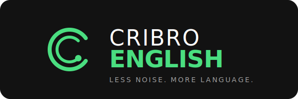

<div align="center">
  
</div>

<br />

<div align="center">
  
  
  
  
  
</div>

<br />

CRIBRO ENGLISH to nowoczesna, oparta na sztucznej inteligencji platforma do nauki języka angielskiego. Aplikacja wykorzystuje AI do generowania spersonalizowanych list słownictwa, śledzi postępy za pomocą systemu powtórek (Spaced Repetition) i zapewnia angażujące, interaktywne sesje ćwiczeń.

## ✨ Features / Główne funkcje

- 🧠 **AI-Powered Vocabulary**: Generowanie niestandardowych zestawów słów dostosowanych do konkretnego poziomu zaawansowania i zainteresowań przy użyciu sztucznej inteligencji.
- 🔄 **Spaced Repetition System (SRS)**: Inteligentne algorytmy śledzące postępy w nauce, które przypominają o słowach dokładnie wtedy, gdy zaczynasz je zapominać.
- 🎮 **Interactive Exercises**: Nauka nowych słów poprzez różnorodne tryby ćwiczeń:
  - Fiszki (Flashcards)
  - Dopasowywanie (Match the Word)
  - Wypełnianie luk z kontekstem (Fill in the Blanks)
  - Quizy wielokrotnego wyboru (Multiple Choice Quizzes)
- 🎧 **Audio Pronunciations**: Wysokiej jakości nagrania wymowy do każdego wygenerowanego słowa, wspierające naukę poprawnego akcentu.
- 📊 **Progress Dashboard**: Wizualizacja postępów w nauce ze szczegółowymi statystykami i poziomem opanowania materiału.

## 🛠 Tech Stack / Technologie

- **Frontend:** React 18, TypeScript, Vite
- **Styling:** Tailwind CSS, Lucide Icons, Canvas Confetti
- **Backend & Auth:** Firebase (Authentication, Firestore Database)
- **AI Integration:** Google Gemini AI

## 🚀 Getting Started / Uruchomienie

### Prerequisites

- Node.js (wersja 18 lub wyższa)
- npm lub yarn
- Skonfigurowany projekt Firebase

### Installation

1. Sklonuj repozytorium:
   ```bash
   git clone https://github.com/yourusername/cribro-english.git
   cd cribro-english
   ```

2. Zainstaluj zależności:
   ```bash
   npm install
   ```

3. Skonfiguruj zmienne środowiskowe:
   Utwórz plik `.env` w głównym katalogu (wzorując się na `.env.example`):
   ```env
   VITE_FIREBASE_API_KEY=your_firebase_api_key_here
   ```

4. Uruchom serwer developerski:
   ```bash
   npm run dev
   ```

## 📁 Project Structure / Struktura projektu

- `/src/components` - Komponenty UI, Dashboard, Landing Page, Tryby ćwiczeń
- `/src/context` - Konteksty React (Autoryzacja, Tłumaczenia, Języki)
- `/src/hooks` - Niestandardowe hooki React
- `/src/services` - Integracje z zewnętrznymi usługami (Firebase)
- `/src/utils` - Funkcje pomocnicze

## 👨‍💻 Author

**Maciej Wyrozumski**
- Portfolio: [maciej.pro](https://www.maciej.pro)

---
*Built with ❤️ for better language learning.*
