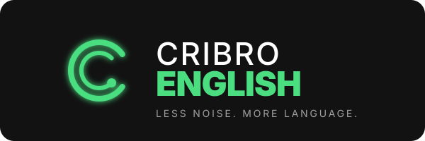

<div align="center">
  
</div>

<br />

<div align="center">
  
  
  
  
  
</div>

<br />

CRIBRO ENGLISH to nowoczesna, oparta na sztucznej inteligencji platforma do nauki języka angielskiego. Aplikacja wykorzystuje AI do generowania spersonalizowanych list słownictwa, śledzi postępy za pomocą systemu powtórek (Spaced Repetition) i zapewnia angażujące, interaktywne sesje ćwiczeń.

## ✨ Features / Główne funkcje

- 🧠 **AI-Powered Vocabulary**: Generowanie niestandardowych zestawów słów dostosowanych do konkretnego poziomu zaawansowania i zainteresowań przy użyciu sztucznej inteligencji.
- 🔄 **Spaced Repetition System (SRS)**: Inteligentne algorytmy śledzące postępy w nauce, które przypominają o słowach dokładnie wtedy, gdy zaczynasz je zapominać.
- 🎮 **Interactive Exercises**: Nauka nowych słów poprzez różnorodne tryby ćwiczeń:
  - Fiszki (Flashcards)
  - Dopasowywanie (Match the Word)
  - Wypełnianie luk z kontekstem (Fill in the Blanks)
  - Quizy wielokrotnego wyboru (Multiple Choice Quizzes)
- 🎧 **Audio Pronunciations**: Wysokiej jakości nagrania wymowy do każdego wygenerowanego słowa, wspierające naukę poprawnego akcentu.
- 📊 **Progress Dashboard**: Wizualizacja postępów w nauce ze szczegółowymi statystykami i poziomem opanowania materiału.

## 🛠 Tech Stack / Technologie

- **Frontend:** React 18, TypeScript, Vite
- **Styling:** Tailwind CSS, Lucide Icons, Canvas Confetti
- **Backend & Auth:** Firebase (Authentication, Firestore Database)
- **AI Integration:** Google Gemini AI

## 🚀 Getting Started / Uruchomienie

### Prerequisites

- Node.js (wersja 18 lub wyższa)
- npm lub yarn
- Skonfigurowany projekt Firebase

### Installation

1. Sklonuj repozytorium:
   ```bash
   git clone https://github.com/yourusername/cribro-recall.git
   cd cribro-recall
   ```

2. Zainstaluj zależności:
   ```bash
   npm install
   ```

3. Skonfiguruj zmienne środowiskowe:
   Utwórz plik `.env` w głównym katalogu (wzorując się na `.env.example`):
   ```env
   VITE_FIREBASE_API_KEY=your_firebase_api_key_here
   ```

4. Uruchom serwer developerski:
   ```bash
   npm run dev
   ```

## 🔐 Bezpieczeństwo / Security

Trzy zasady, o które łatwo się potknąć przy rozwijaniu tego projektu.

**Klucze API nigdy z przedrostkiem `VITE_`.** Vite podstawia wartość każdej
takiej zmiennej wprost do plików wysyłanych do przeglądarki — klucz, za który
płacisz, byłby wtedy widoczny dla każdego odwiedzającego. Wszystkie wywołania
modeli idą przez własny serwer: `/api/openai`, `/api/gemini/generate` i
`/api/tts`, a klucze siedzą pod `OPENAI_API_KEY` i `GEMINI_API_KEY`. Trasy te
wymagają zalogowania, więc serwer musi umieć zweryfikować token: wystarczy
`FIREBASE_PROJECT_ID` (albo konfiguracja Firebase, z której da się go odczytać),
a `FIREBASE_SERVICE_ACCOUNT` potrzebne jest dodatkowo do operacji
administracyjnych na kontach.

**Reguły Firestore trzeba wdrożyć osobno.** Plik `firestore.rules` w repozytorium
nie działa, dopóki go nie wyślesz — commit sam z siebie niczego nie zmienia:

```bash
firebase login
firebase deploy --only firestore:rules
```

`firebase.json` wskazuje nazwaną bazę danych używaną przez aplikację, a nie
`(default)` — bez tego reguły trafiłyby obok właściwych danych.

**Prace domowe rozpoznaje się po `studentUid`.** Kolekcja `specialTasks` jest
płaska i wspólna dla wszystkich kursantów, więc to jedyne pole, po którym reguła
odróżnia własne zadanie od cudzego. Każde zapytanie kursanta musi zawierać
`where('studentUid', '==', uid)` — pobranie całej kolekcji i odsianie cudzych
zadań w przeglądarce zostanie odrzucone w całości. Gotowe zapytanie i komplet
pól do zapisu są w `utils/homework.ts`. Stare dokumenty uzupełnia
`scripts/backfill-task-owners.mjs` (najpierw bez `--apply`, żeby zobaczyć, co
zrobi).

## 🧪 Starter Project: TypeScript + Python

W repozytorium jest teraz prosty projekt edukacyjny dostępny pod ścieżką `/starter`.

Frontend:
```bash
npm run dev
```

Backend Python:
```bash
python3 -m venv .venv
source .venv/bin/activate
pip install -r python_api/requirements.txt
npm run dev:starter:backend
```

Po uruchomieniu obu procesów otwórz:

```text
http://localhost:3000/starter
```

Backend udostępnia dokumentację Swagger pod adresem:

```text
http://127.0.0.1:8000/docs
```

Co ćwiczysz w tym mini-projekcie:
- formularze i stan po stronie React + TypeScript,
- komunikację HTTP między frontendem i backendem,
- walidację danych w Python FastAPI,
- prostą logikę biznesową i zapis danych do JSON.

## 📁 Project Structure / Struktura projektu

- `/src/components` - Komponenty UI, Dashboard, Landing Page, Tryby ćwiczeń
- `/src/context` - Konteksty React (Autoryzacja, Tłumaczenia, Języki)
- `/src/hooks` - Niestandardowe hooki React
- `/src/services` - Integracje z zewnętrznymi usługami (Firebase)
- `/src/utils` - Funkcje pomocnicze

## 👨‍💻 Author

**Maciej Wyrozumski**
- Portfolio: [maciej.pro](https://www.maciej.pro)

---
*Built with ❤️ for better language learning.*
